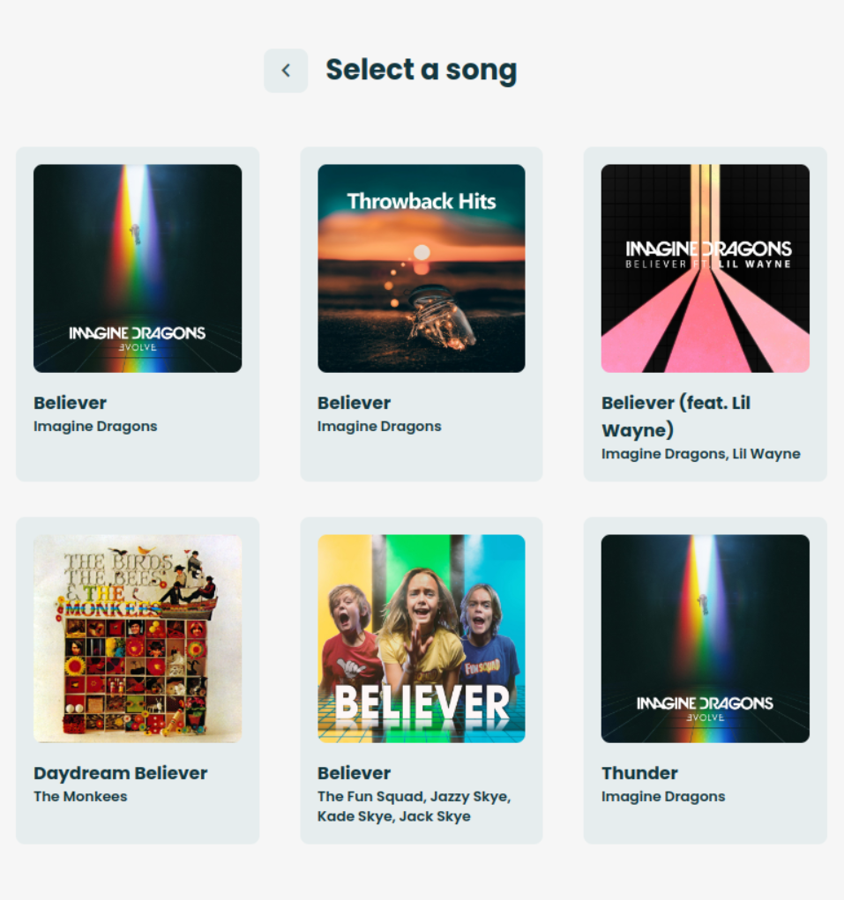
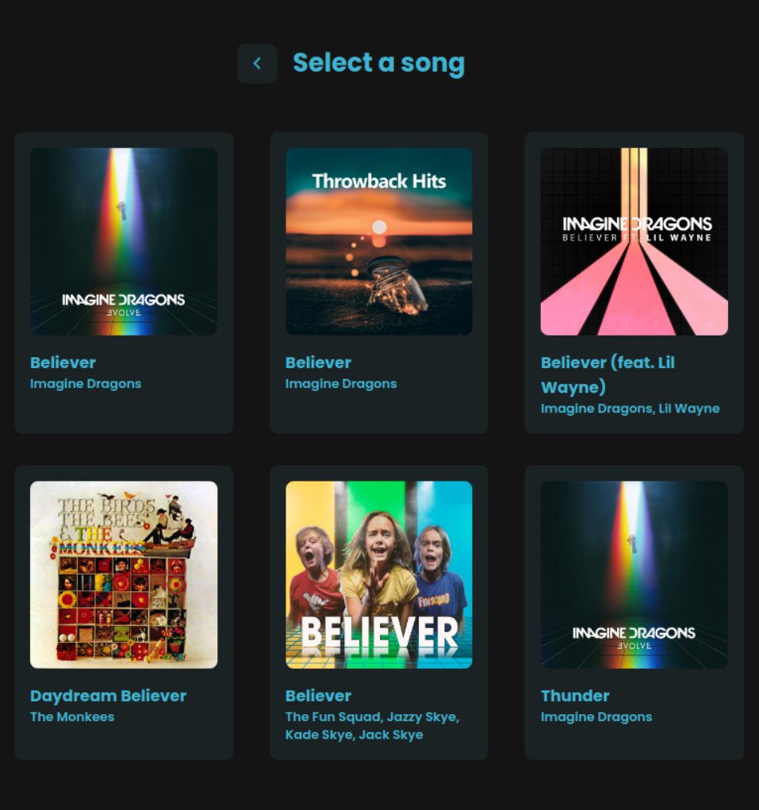
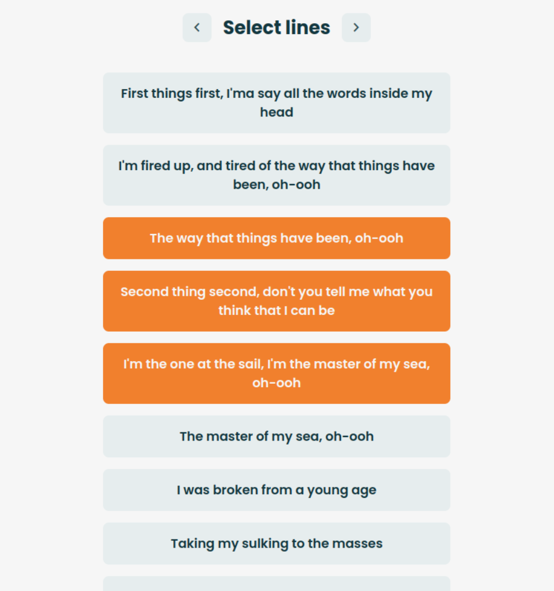
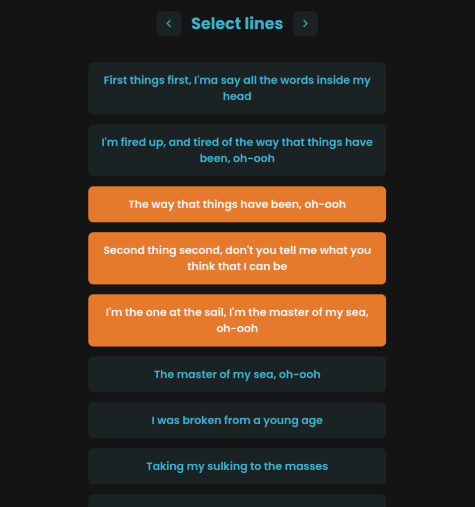
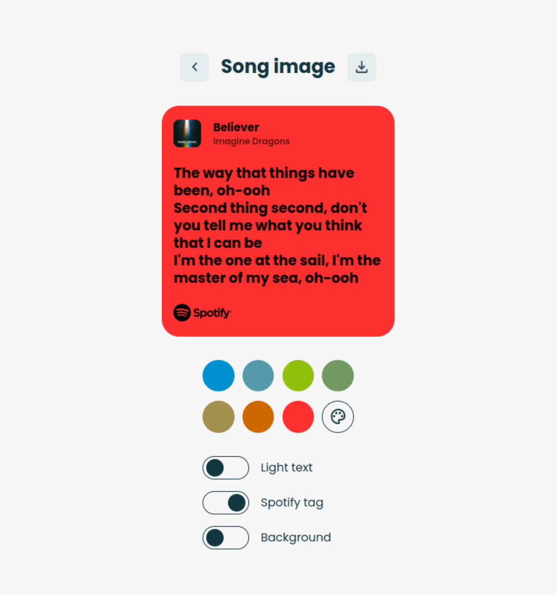
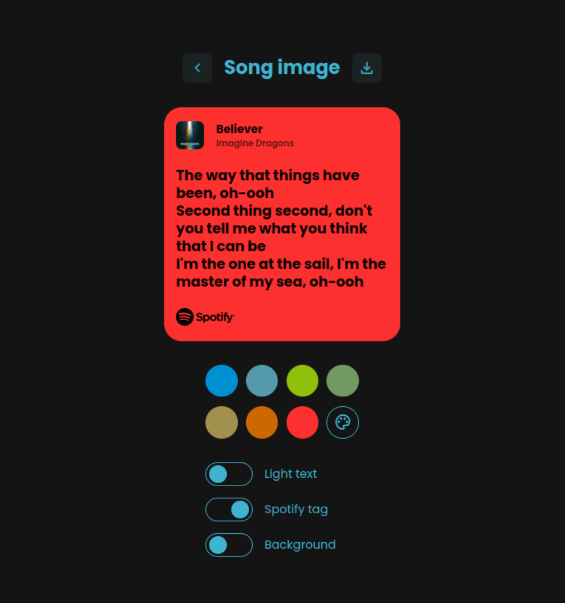

# LyricPost

> A simple yet powerful Spotify-like lyrics image generator built entirely with vanilla JavaScript.

## Introduction

LyricPost is a web application that allows users to generate Spotify-like lyrics images.
By entering the name of a song, users can fetch songs from Spotify, select one, and then fetch the corresponding lyrics from lrclib.
Users can then select lines from the lyrics and generate a stylish image with customizable colors and other settings.

## Features

- Finding a song using [Spotify Web API](https://developer.spotify.com/documentation/web-api)
- Fetching the lyrics from [lrclib](https://lrclib.net/docs)
- Generating a share-ready lyrics image with selected lyrics
- Customizing colors and other elements of the generated image
- Downloading the image in high quality

## Live version

You can check it out [here](https://palinkiewicz.github.io/lyricpost/).

## Screenshots

Light mode                         | Dark mode
:---------------------------------:|:---------------------------------:
 | 
 | 
 | 

## Local installation

1. Clone the repo <br> ```https://github.com/palinkiewicz/lyricpost```
2. Run index.html

It's that easy!

## Disclaimer
This project is not affiliated with or endorsed by Spotify.
The Spotify logo is used in compliance with Spotify's branding guidelines and is fetched from an outside source.
