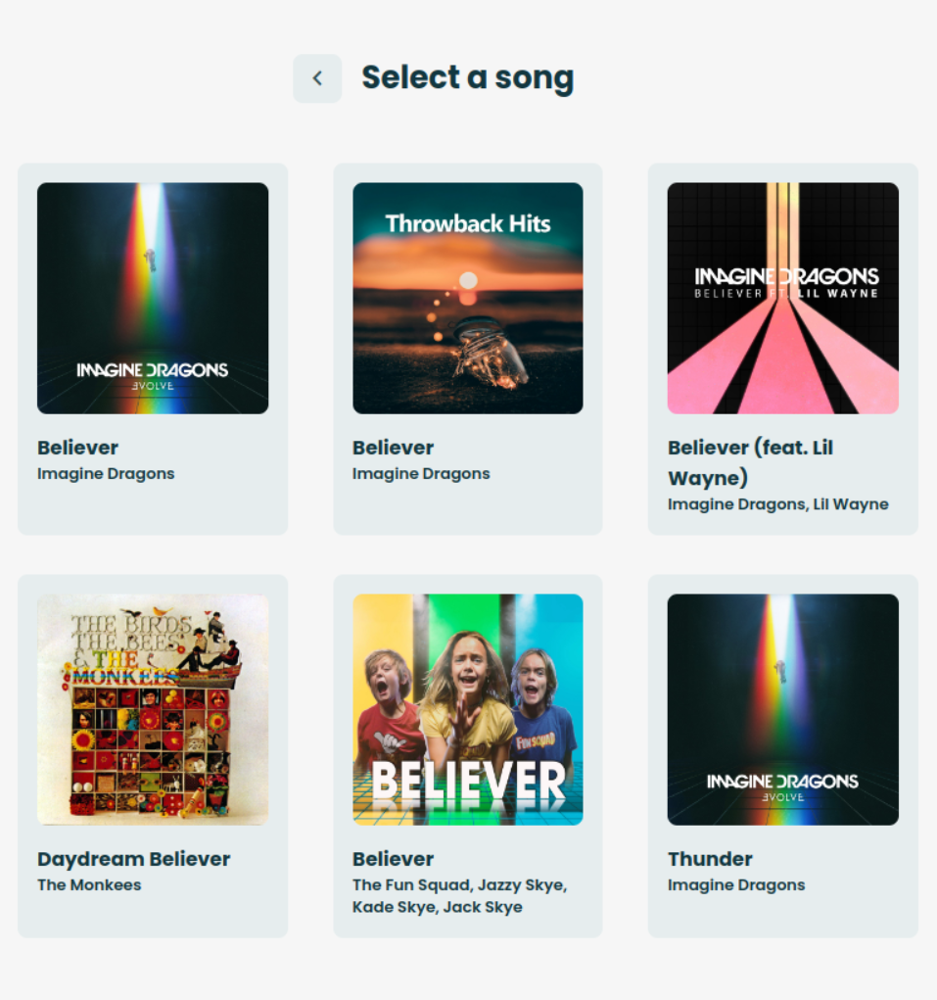
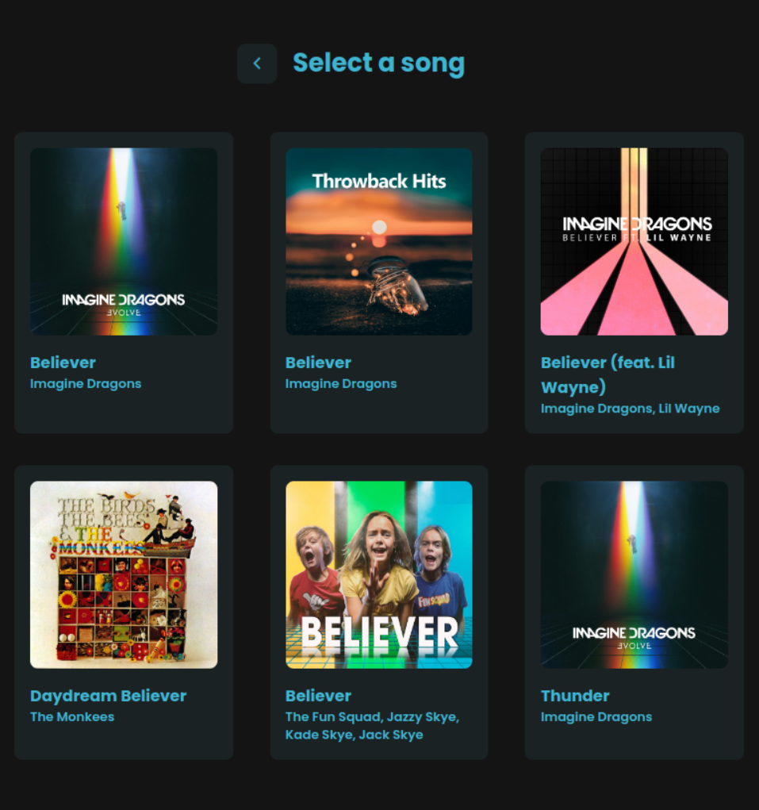
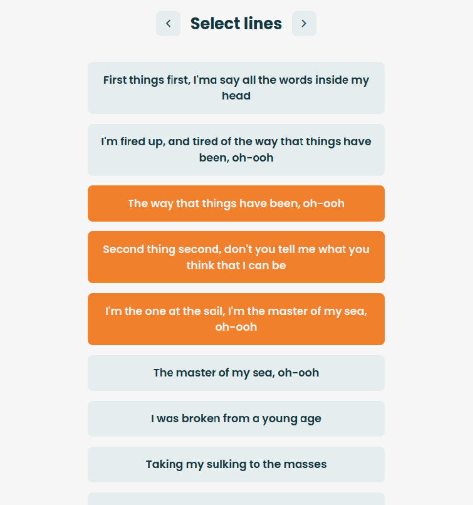
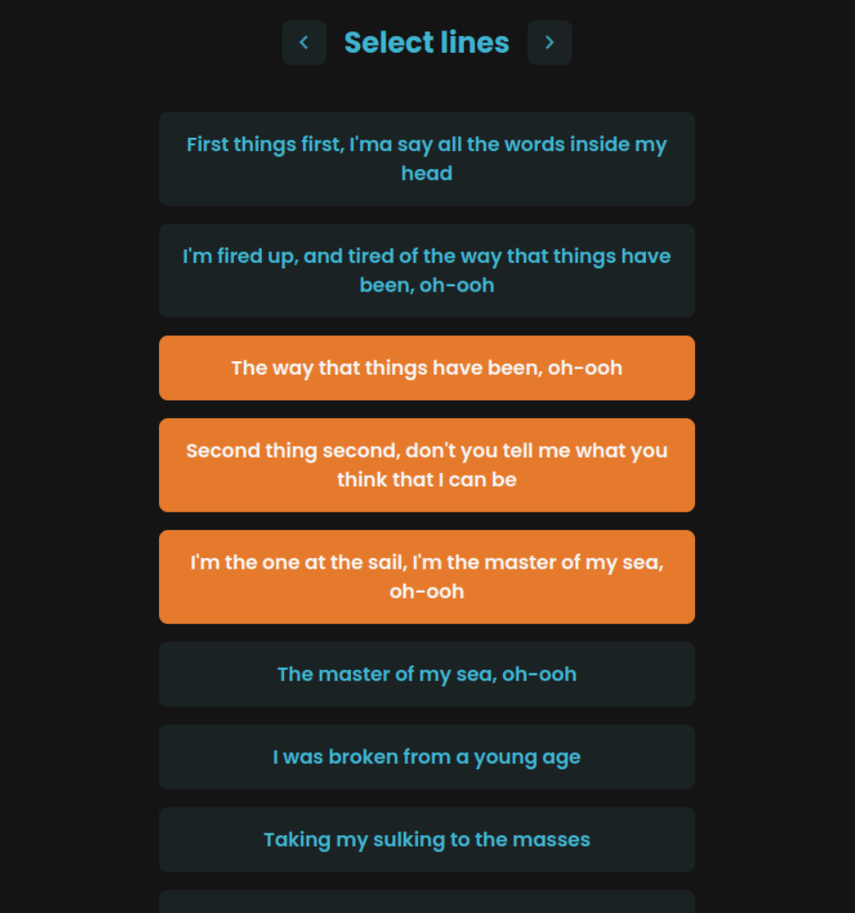
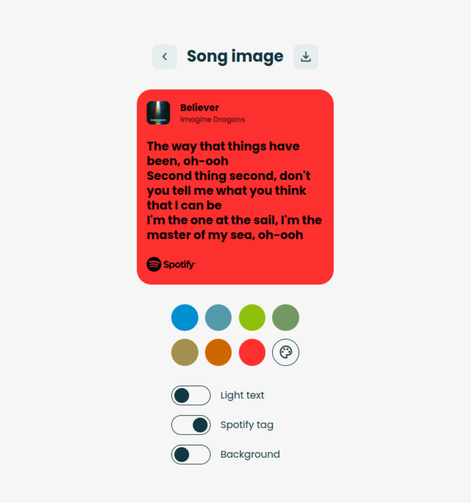
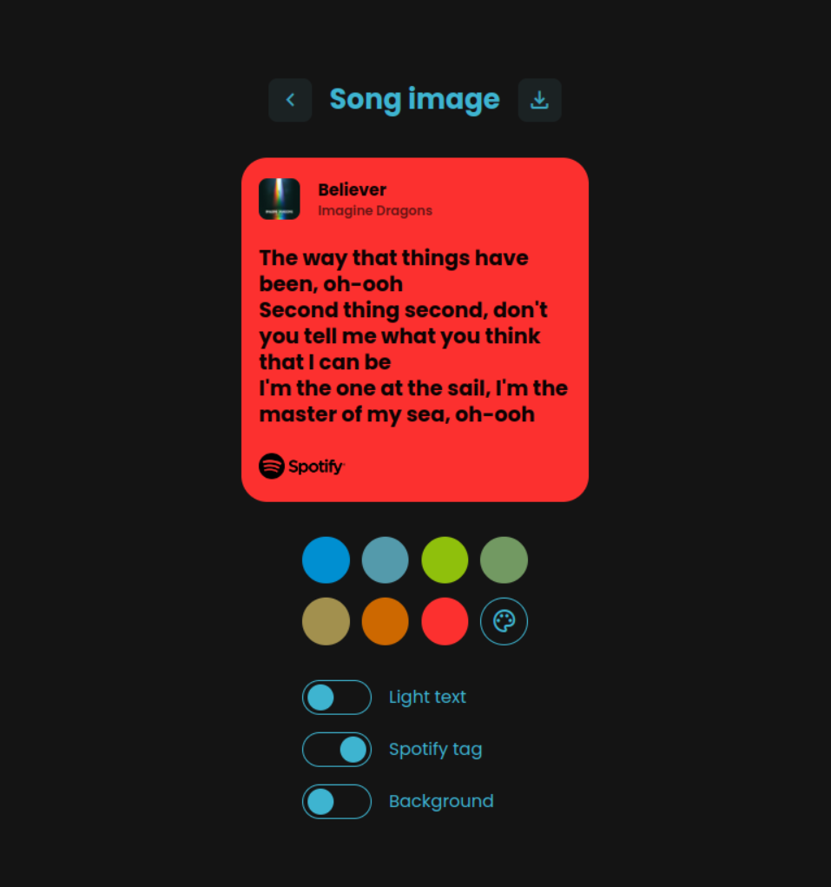

# LyricPost

> A simple yet powerful Spotify-like lyrics image generator built entirely with vanilla JavaScript.

## Introduction

LyricPost is a web application that allows users to generate Spotify-like lyrics images.
By entering the name of a song, users can fetch songs from [Last.fm](https://www.last.fm/), select one, and then fetch the corresponding lyrics from [lrclib](https://lrclib.net/docs).
Users can then select lines from the lyrics and generate a stylish image with customizable colors and other settings.

## Features

- Finding a song using [Last.fm](https://www.last.fm/)
- Fetching album cover from [CoverArtArchive](https://coverartarchive.org/)
- Fetching the lyrics from [lrclib](https://lrclib.net/docs)
- Generating a share-ready lyrics image with selected lyrics
- Customizing colors and other elements of the generated image
- Downloading the image in high quality

## Live version

You can check it out [here](https://palinkiewicz.github.io/lyricpost/).

## Screenshots

Light mode                         | Dark mode
:---------------------------------:|:---------------------------------:
 | 
 | 
 | 

## Local installation

1. Clone the repo <br> ```https://github.com/palinkiewicz/lyricpost```
2. Run index.html

It's that easy!

## Local development

LyricPost now ships with a small Node.js (Express) backend that proxies the
Last.fm and lrclib APIs so that no API keys are exposed in the browser.

1. Install dependencies: `npm install`
2. (Optional) Copy `.env.example` to `.env` and set your own `LASTFM_API_KEY`.
   If `.env` is missing, the server falls back to the bundled key and prints a
   warning.
3. Start the server: `npm start`
4. Open `http://localhost:3000` in your browser.

The Express server serves the static frontend (`index.html`, `classes/`,
`styles/`, `.screenshots/`) and exposes the following endpoints:

- `GET /api/songs/search?name=<query>&limit=<n>`
- `GET /api/songs/track/:mbid`
- `GET /api/lyrics?artist=<a>&track=<t>`

## Disclaimer

This project is not affiliated with or endorsed by Spotify.
The Spotify logo is used in compliance with Spotify's branding guidelines and is fetched from an outside source.
